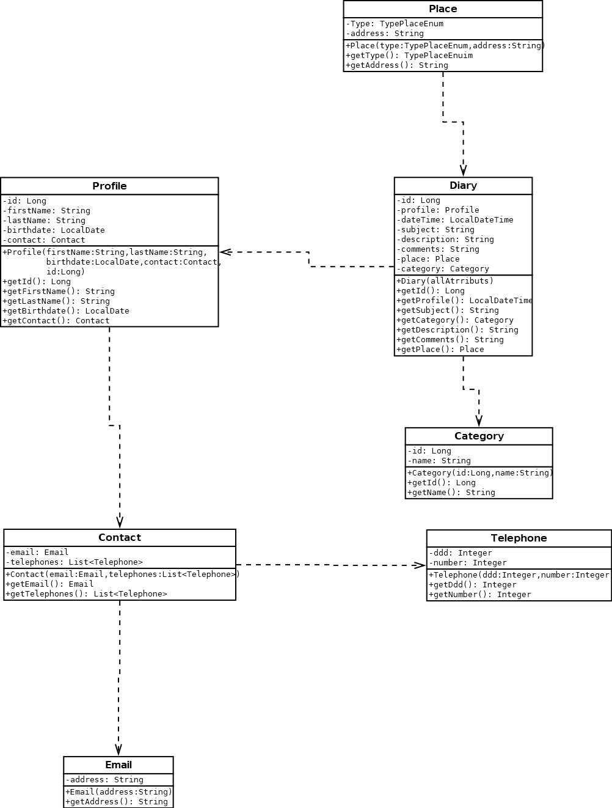
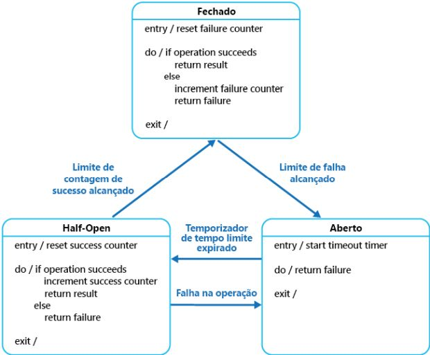

# AGENDA INTELIGENTE - POC UTILIZANDO CIRCUIT BREAKER

O objetivo do projeto e demonstrar a utilizacao do que, em projeto de programacao, e considerado um design pattern o Circuit Breaker. 

Abaixo o esquema de entidades usado como conceito:



---

# 1. Ferramentas utilizadas:
- Java 11
- Spring Boot [Spring initializr](https://start.spring.io/)
    - JPA
    - Web
    - actuator
- Resilience4J [Documentacao](https://resilience4j.readme.io/docs)
- MariaDB [MariaDB](https://mariadb.org/)
- WildFly 20 [Documentacao](https://docs.wildfly.org/20/)

# 2. Os sistemas:

* **database:**

O sistema database e responsavel pela conexao com o banco de dados, e fazer os CRUD (Create, REad, Update, Delete) dos dados. Ele fornece uma API para fazer isso, porem nao possui validacao.

* **webservice**
O sistema e responsavel pro validar os dados ao fazer a chamada para sistema database. Nele foi implementado o Circuit Breaker. Entao, o texto sera focado nesse sistema.

---

# 3. Circuit Breaker

O design pattern do Circuit Breaker a sua finalidade e prevenir sistemas de fazer chamadas a operações que estão em estado de falha. Atuando como um proxy em chamadas em que podem falhar.   

## 3.1. Circuit Breaker e seus estados:
1. **Fechado** - estado em que as chamadas estão sendo bem sucedidas. Caso haja uma falha, ele incrementará na contagem de falha. Caso essa contagem de falha exceda o limite, passará para o estado de Aberto.
2. **Aberto** - a chamada não é bem sucedida, retornando a função/exceção que foi definida imediatamente. 
3. **Meio-Aberto** - e o estado quando uma quantidade de chamadas for feito, e forem bem sucedidas, o Circuit Breaker considera que foi corrigido o problema e mudará para Fechado novamente. Se ocorrer uma nova falha em alguma chamada, retorna o estado para Aberto.

## 3.2. Fluxo dos estados



## 3.3. Quando usar:

Quando existe um serviço que faz chamadas externas a outro serviços.

## 3.4. Observações:

- Registrar em log as falhas e estados
- Se possivel tratamento de exceções na aplicação

# 4. Resilience4J

O Resilience4J e uma das implementacoes do Circuit Breaker, ele tambem implementa outros Design Pattern. Possui integracao com o Spring Boot, tambem possui integracao com Spring Boot Actuator (para fazer registros e logs da saude da aplicacao).

### 4.1. Implementando na aplicação:

A implementacao sera feita na aplicacao **webservice**, pois ela esta chamando a aplicacao **database**, podendo ocorrer alguma falha.

1. Adicionar as dependencias no projeto webservice:

```xml
		<dependency>
			<groupId>org.springframework.boot</groupId>
			<artifactId>spring-boot-starter-actuator</artifactId>
		</dependency>

		<dependency>
			<groupId>io.github.resilience4j</groupId>
			<artifactId>resilience4j-spring-boot2</artifactId>
			<version>1.7.0</version>
		</dependency>
		<dependency>
			<groupId>org.springframework.boot</groupId>
			<artifactId>spring-boot-starter-aop</artifactId>
		</dependency>
 ```

 2. Configurar o Circuit Breaker no arquivo properties:

 ```properties
resilience4j.circuitbreaker.instances.webservice1_getallcategories.slidingWindowSize=10
resilience4j.circuitbreaker.instances.webservice1_getallcategories.minimumNumberOfCalls=5
resilience4j.circuitbreaker.instances.webservice1_getallcategories.registerHealthIndicator=true
resilience4j.circuitbreaker.configs.default.registerHealthIndicator=true
 ```

 Explicando, webservice1_getallcategories e o nome do meu Circuit Breaker, entao comum e repetir essas linhas novamente, porem com outro nome. 
 A propriedade slidingWindowSize por definir o tamanho da janela que usado para registrar o resultado das chamadas quando o Circuit Breaker e fechado. 
A propriedade minimumNumberOfCalls e responsavel configurar o numero minimo de chamadas necessarias (por periodo de slidingWindowSize) antes que o Circuit Breaker possa calcular a taxa de erro. Que por padrao e 50%.